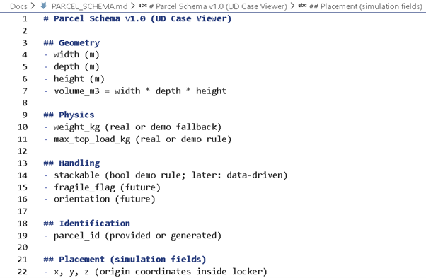
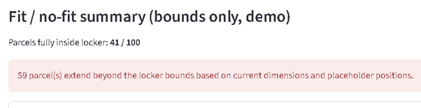
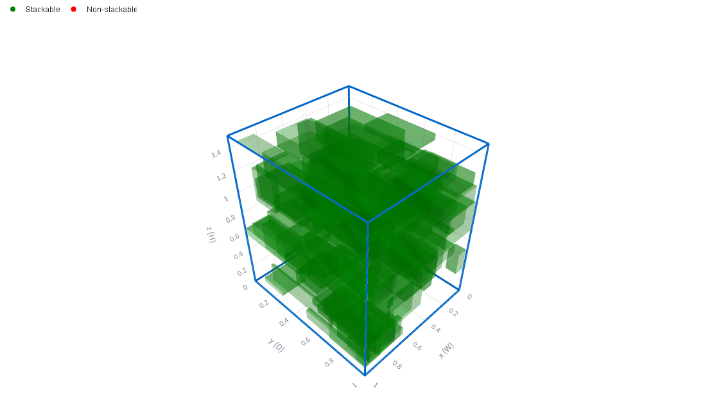
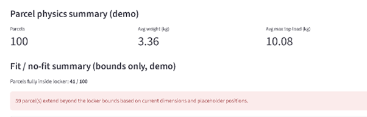

# AI Case Viewer (TCNS Portfolio)
## Docs (Option B – technical)

- Technical notes: [Docs/TECHNICAL_NOTES.md](Docs/TECHNICAL_NOTES.md)
- Parcel schema: [Docs/PARCEL_SCHEMA.md](Docs/PARCEL_SCHEMA.md)

This repository contains a small, hands-on AI engineering portfolio focused on
**constraint-based reasoning, decision support, and digital twin concepts**
applied to logistics and operations.

The core artifact is a **Streamlit-based Case Viewer** that demonstrates how
real operational constraints can be translated into data models, simulations,
and explainable visual outcomes.

---
## 📘 WAW — Walk Around the Work (Read-only)

> **Audience:** Marcel (ABB), systems & architecture review  
> **Mode:** WAW (Walk Around the Work) — *no code execution required*  
> **Purpose:** Explain *how* parcel space optimization works, *why* decisions are explainable, and *how* this scales

This repository contains a **design and reasoning walkthrough**, not a live demo.  
You are **not expected to run Python or Streamlit**.  
The screenshots below illustrate what the system does conceptually at each step.

---

## 🧩 Screen 1 — Parcel input & constraints (governed data)



**What this shows**  
Parcels enter the system as **structured data objects** with explicit attributes:
- geometry (width, depth, height, volume)
- physics (weight, max top load)
- handling rules (stackable, fragile, orientation)
- identification
- placement fields (simulation outputs)

**Why this matters**  
Constraints are **first-class, auditable data**, not hidden assumptions.  
This is the governance foundation for explainable optimization.

---

## 🚦 Screen 2 — Fit vs No-Fit decision (explainability anchor)



**What this shows**  
Each parcel is evaluated against the current space (locker/compartment):
- parcels that **fit**
- parcels that **do not fit**, which remain explicitly visible

No-fit parcels are **not discarded**; they are surfaced as exceptions.

**Why this matters**  
Operational trust depends on knowing *what failed and why*.  
This enables exception handling, escalation, and future optimization.

---

## 📦 Screen 3 — 3D placement (deterministic spatial reasoning)



**What this shows**  
Parcels that pass the fit check are placed into the space using **deterministic 3D logic**:
- explicit coordinates
- orientation
- locker boundary visible
- handling rules applied (e.g. stackable vs non-stackable)

**Why this matters**  
Placement is **traceable and predictable**, not “black-box” behavior.  
This is essential for safety, certification, and operational confidence.

---

## 📊 Screen 4 — Capacity & summary (scaling signal)



**What this shows**  
Aggregate signals derived from the placement result:
- number of parcels processed
- parcels placed vs rejected
- physical characteristics (weights, loads)

**Why this matters**  
This layer enables planning, monitoring, and scaling — from a single space to many.

---

## 🔁 How this scales (roadmap)

- **Today:** X parcels → **1 space**  
- **Next:** X parcels → **Y spaces** (multi-locker / multi-compartment logic)  
- **Then:** route-level optimization + shared space access  
  (e.g. neighbour access, overflow handling, handover points)

The same principles apply at each level:
**explicit constraints → explainable decisions → operational visibility**.

---

## 📚 Further reading (optional)

For readers who want to explore the underlying logic and data structures in more depth:

- **`Docs/TECHNICAL_NOTES.md`**  
  Design choices, constraint reasoning, and how the current logic evolves toward multi-space and route-level optimization.

- **`Docs/PARCEL_SCHEMA.md`**  
  Parcel data model and governance: how physical, handling, and placement attributes are represented explicitly.

- **`case_viewer.py`**  
  Read-only walkthrough of the end-to-end reasoning flow implemented in the prototype.

---

## 🧭 Context

This work builds on earlier **Unattended Delivery pilots** (e.g. Hoogvliet),
where secure access and delivery-at-location were demonstrated in practice.

The focus here is different:
- not the physical pilot itself
- but the **formalization of the underlying logic** into
  explicit data models, constraints, and explainable reasoning steps

This prepares the concept for:
- integration into broader supply chains
- deployment at locations without traditional addresses
  (e.g. construction sites, project locations, offshore facilities)
- secure shared-access scenarios beyond the home context


## What problem this explores

In real-world operations (e.g. logistics, infrastructure, access systems),
many decisions are still made manually under time pressure, despite being
highly constrained and data-rich.

This project explores:
- How physical and operational constraints can be modeled explicitly
- How spatial problems can be inspected and validated visually
- How AI-assisted tools can support human decision-making without black-box ML

---

## Included case: Unattended Delivery – Space Optimization

The first case models parcel placement inside constrained locker volumes.

It demonstrates:
- 3D spatial reasoning
- Explicit geometry and collision constraints
- Rule-based handling logic (stackability, fragility, orientation)
- Visual validation of “fit / no-fit” decisions

This reflects real challenges observed in last-mile and unattended delivery
operations.

---

## Technical approach (intentionally scoped)

- Python-based data modeling and simulation
- Streamlit for fast, inspectable visualization
- Explicit rules and constraints instead of opaque optimization
- Designed for clarity, extensibility, and reviewability

This is **not a production system**, but a technically honest exploration of
how such systems can be designed.

---

## Quickstart

```bash
pip install -r requirements.txt
streamlit run case_viewer.py
